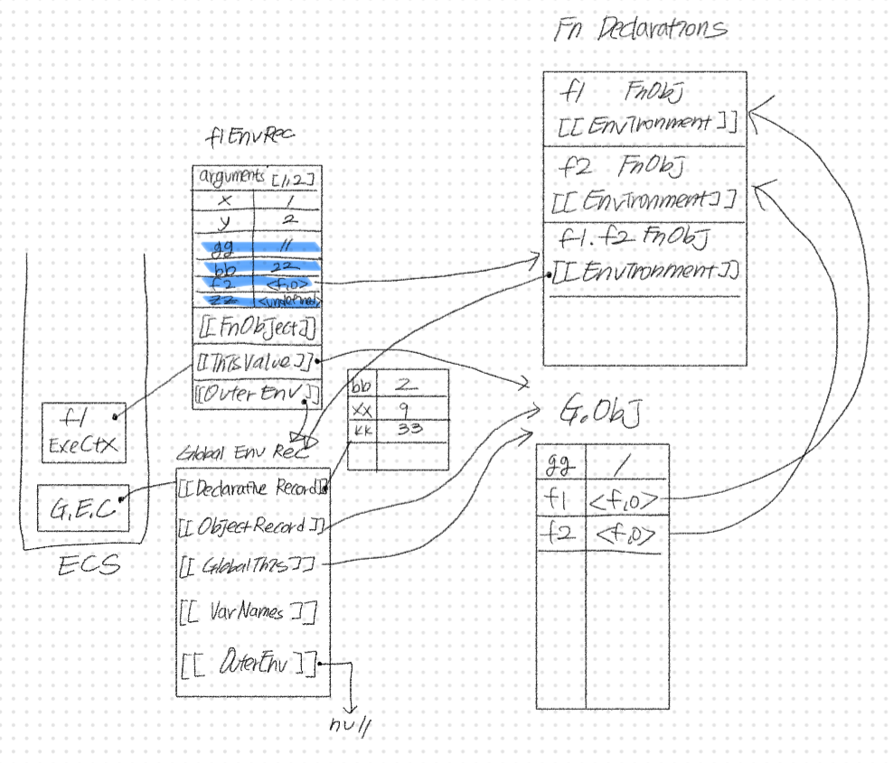

# 실행 컨텍스트 그리기

> [05w/ecsTest.js](https://github.com/0uizi0/sesac-practice/blob/main/05w/ecsTest.js) 코드의 실행 컨텍스트

### 1. `console.log("f1>", gg, bb, zz, f2, f2.length);`

결과 : f1 > 11 22 undefined [Function.f2] 3

### 2. `f2("first");`

결과 : first inner2 9 undefined

### 3. `f2("nest-first");`

결과 : nest-first nested 99 undefined **(((( error ))))**

=> 초기화되지 않은 변수 `lll` 접근으로 인한 **에러 발생**

### 4. `f2("second");`

결과 : second nested 99 800 0

### 5. `console.log(kk, yy);`

결과 : 33 **(((( error ))))**

=> 정의되지 않은 변수 `yy` 접근으로 인한 **에러 발생**

### 6. `f2("third");`

결과 : third global f2 > 1 2 9 33

