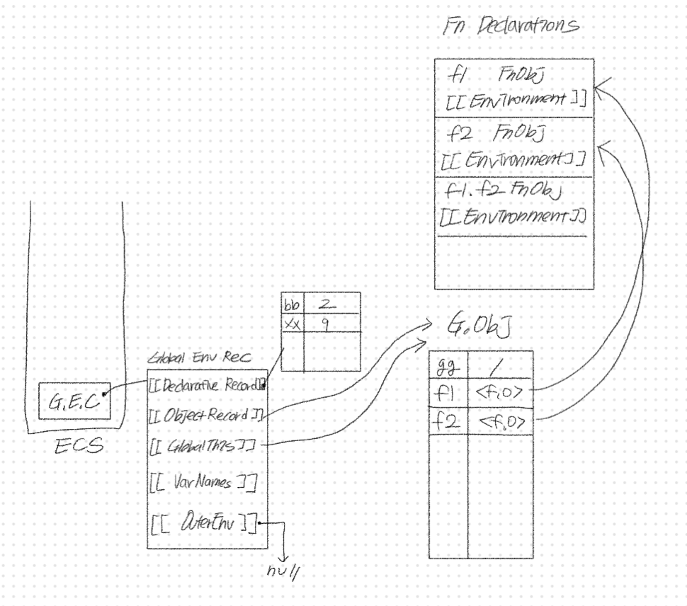
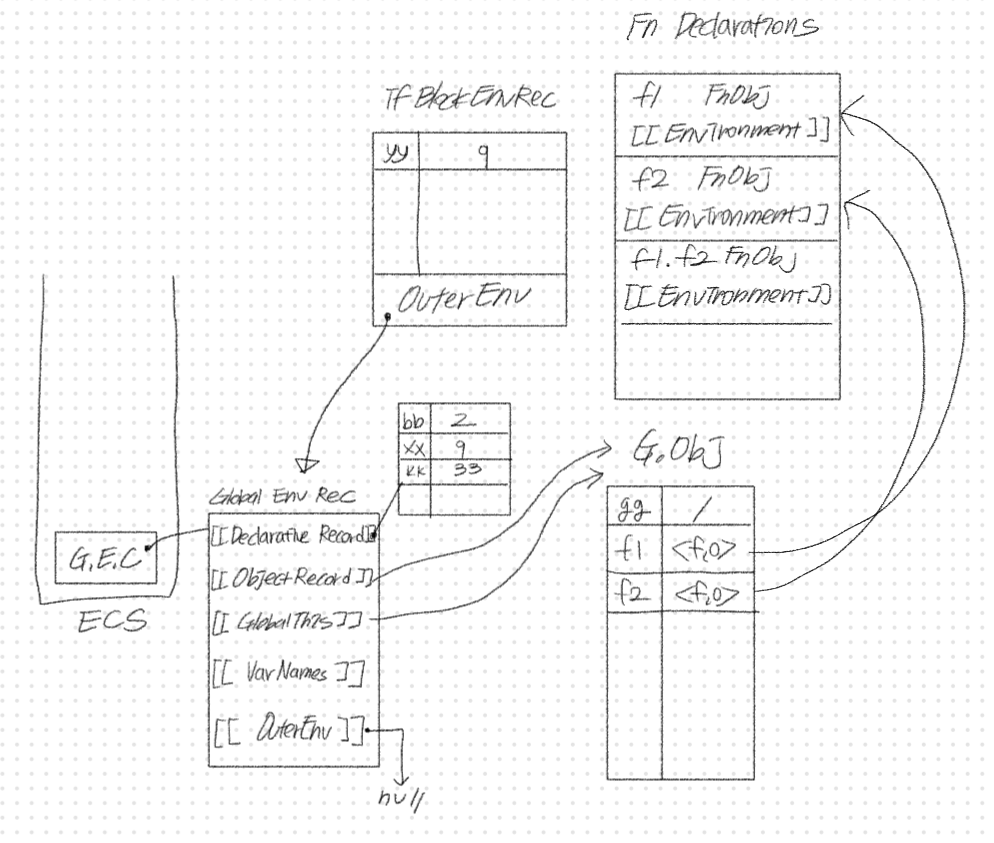
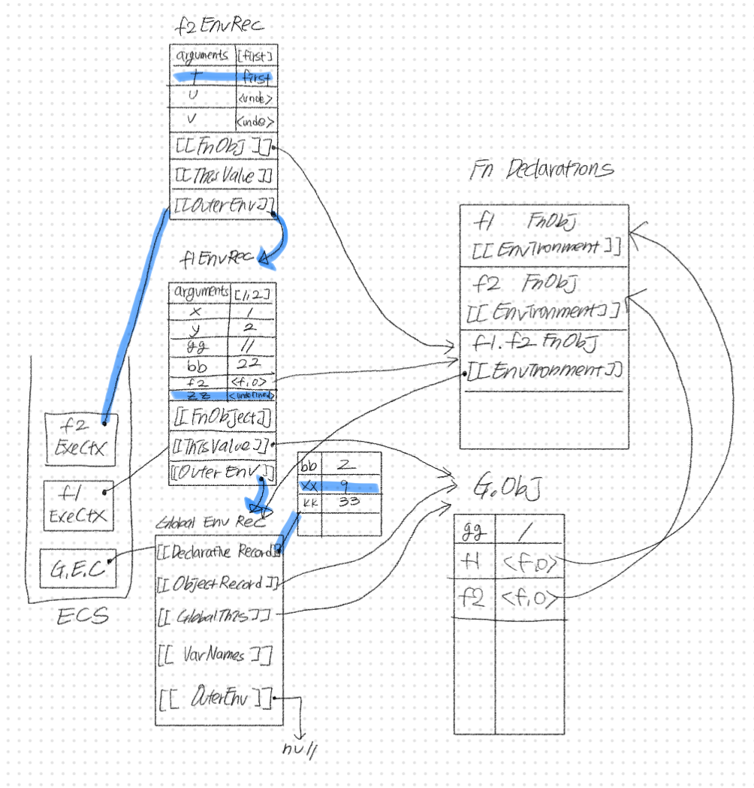
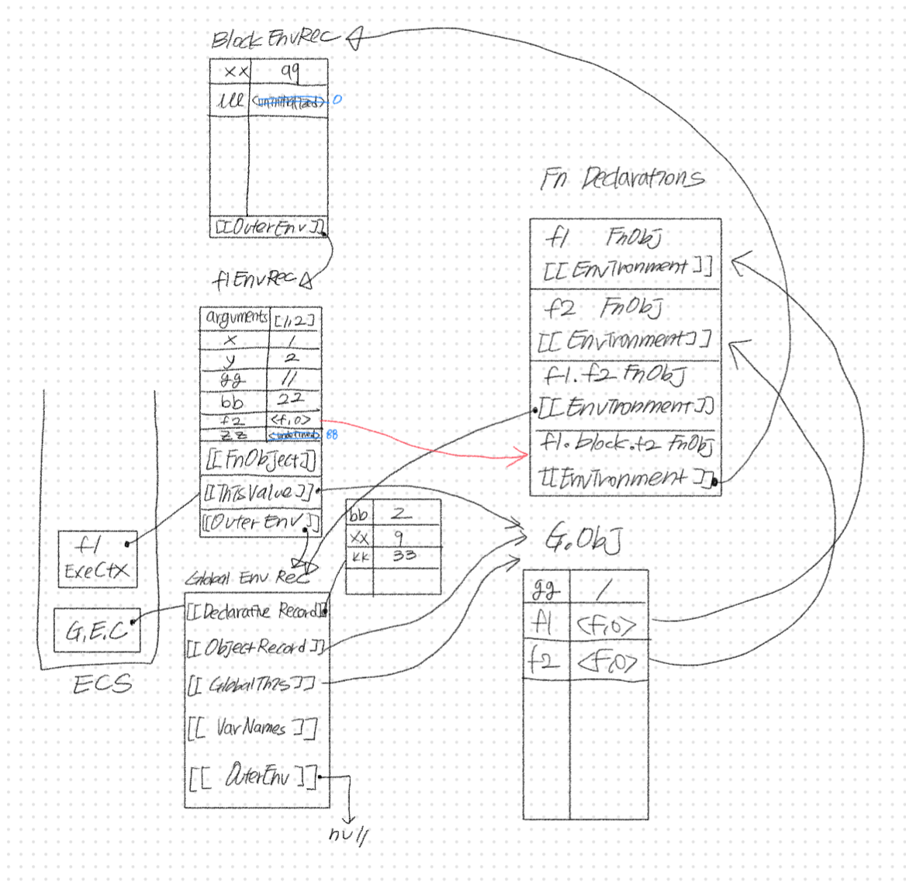

# 실행 컨텍스트 그리기

> [05w/ecsTest.js](https://github.com/0uizi0/sesac-practice/blob/main/05w/ecsTest.js) 코드의 실행 컨텍스트

### 1. `let xx = 9`까지

### 2. if문 실행

### 3. `console.log("f1>", gg, bb, zz, f2, f2.length);`

결과 : f1 > 11 22 undefined [Function.f2] 3

### 4. `f2('first')`

결과 : first inner2 9 undefined

### 5. f2의 block문 -> `f2('nest-first')`까지

결과 : nest-first nested 99 undefined `ERROR`

==> **초기화되지 않은 변수 lll 접근**으로 인한 에러 발생

### 6. `{}` 블록 끝나기 직전

### 7. `f2('second')`

결과 : second nested 99 800 0

### 8. `console.log(kk,yy)`

결과 : 33 `ERROR`

==> **정의되지 않은 변수 yy 접근**으로 인한 에러 발생

### 9. `f2(third)`

결과 : third global f2 > 1 2 9 33

### 10. 실행 끝 => 실행 콘텍스트 스택에 담긴 모든 것들이 pop됨
