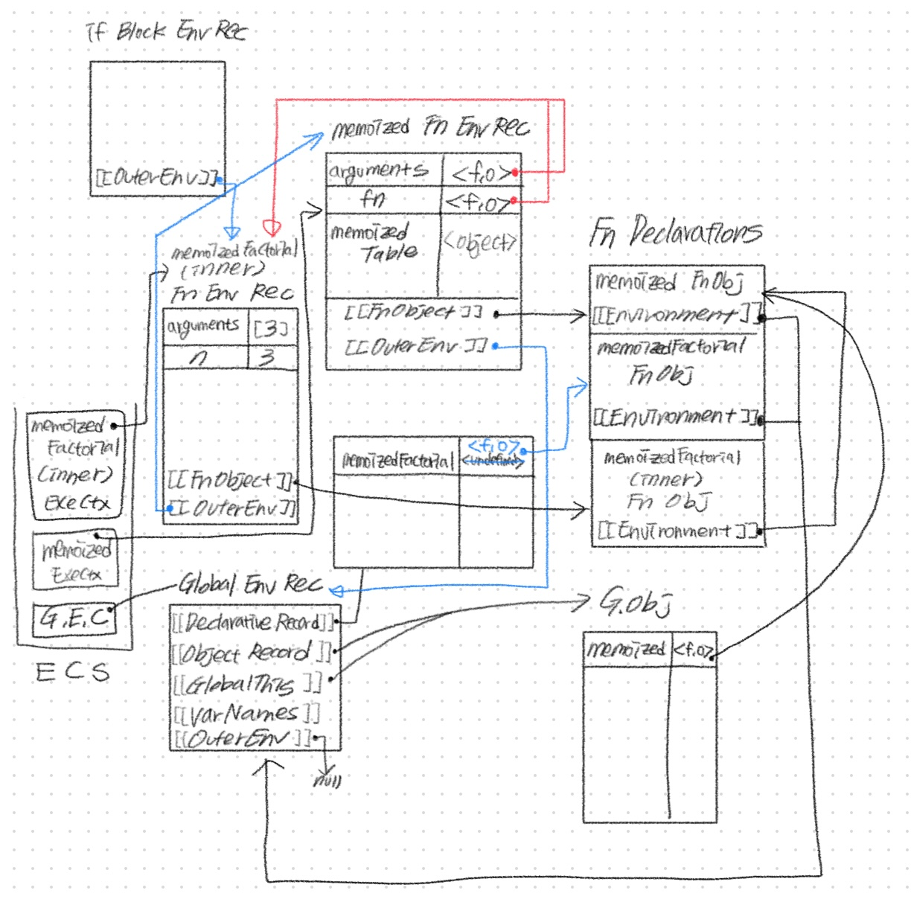

# 피보나치 수열의 실행 컨텍스트 그리기

```js
function memoized(fn) {
  const memoizedTable = {};
  return (n) => memoizedTable[n] || (memoizedTable[n] = fn(n));
}

const memoizedFactorial = memoized(function (n) {
  if (n <= 1) return 1;
  return n * memoizedFactorial(n - 1);
});

console.log(memoizedFactorial(3));
```

위 코드에 해당되는 실행 콘텍스트

## 1차 시도



**헷갈리는 것**

- outerEnv와 Environment가 향하는 방향

- 콜스택에 담기는 순서

- 함수 표현식과 실행 콘텍스트

  - 함수 표현식으로 작성된 함수는 `undefined`로 값이 할당되었다가, `<f.o>`로 변경된다고 판단.

  - 해당 함수는 내부의 함수 memoized를 바로 실행하기 때문에, 콜스택에서 `G.E.C` 다음에 제일 먼저 실행된다고 생각했음

- 함수 인자로 함수를 받는 경우, 실행 콘텍스트는 어떻게 그려지는지?
